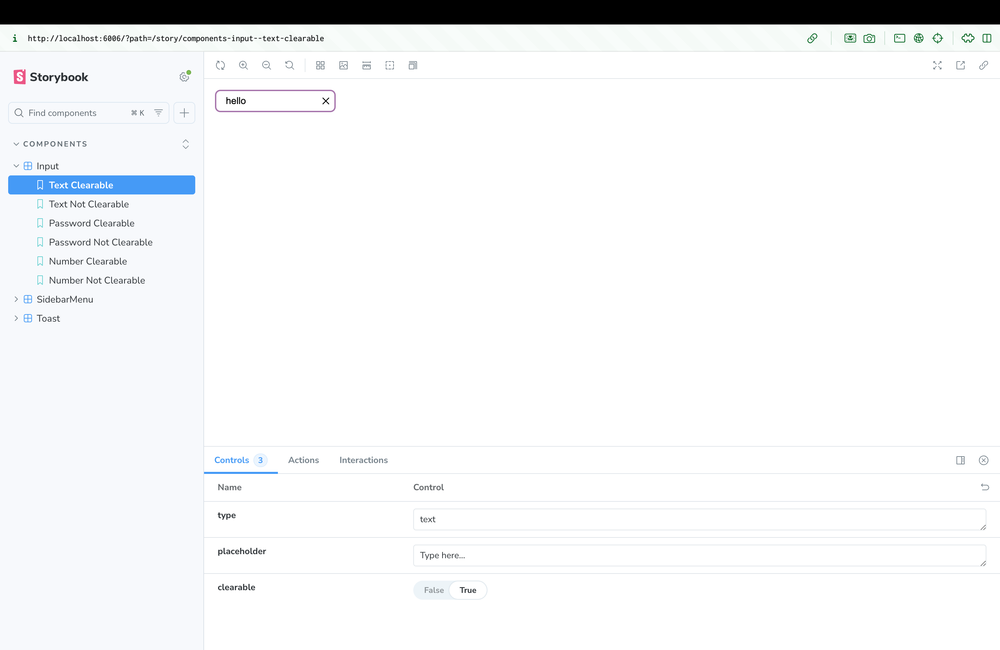
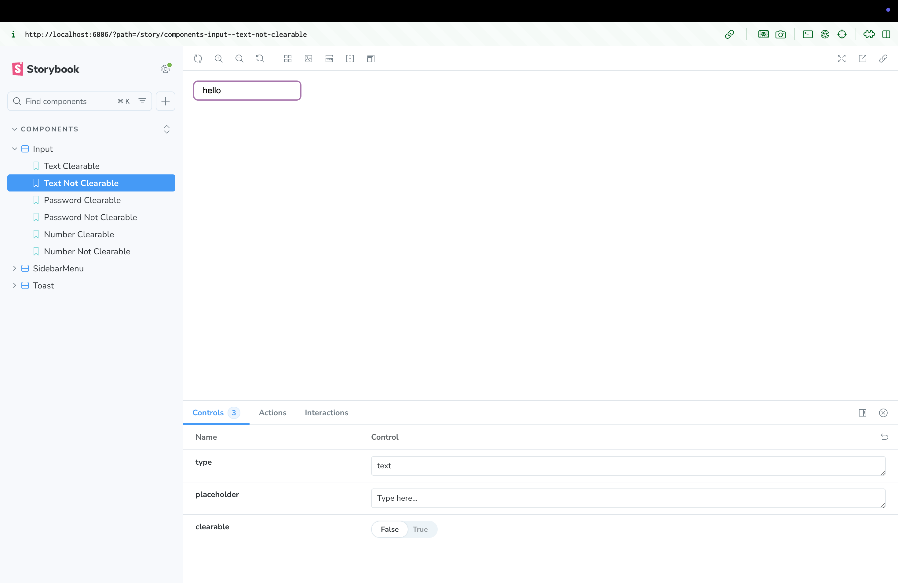
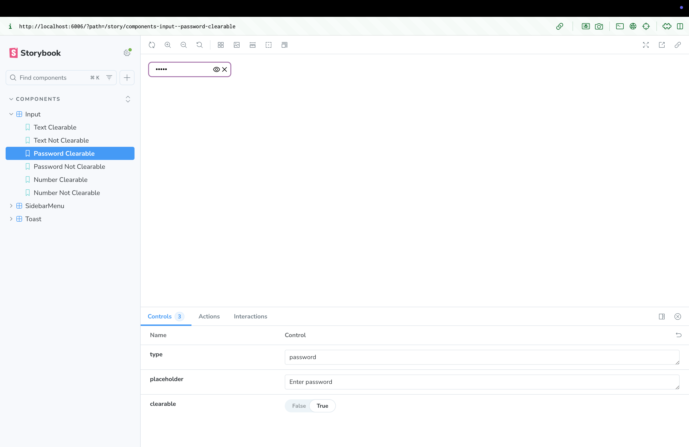
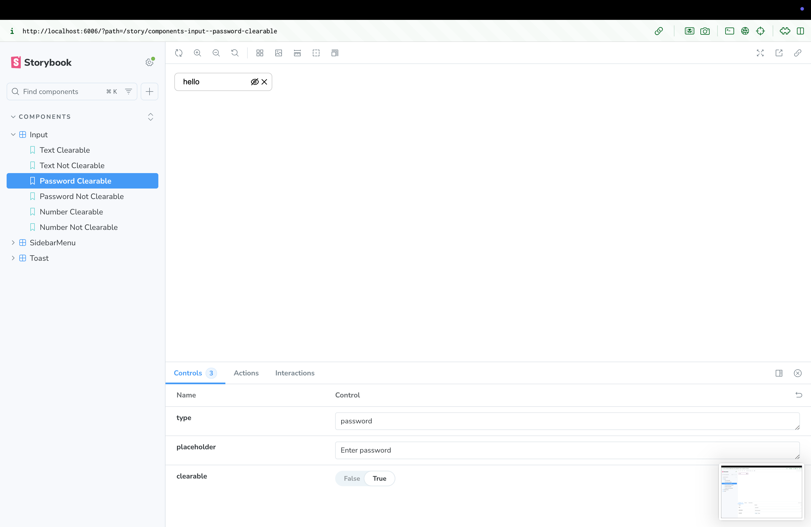
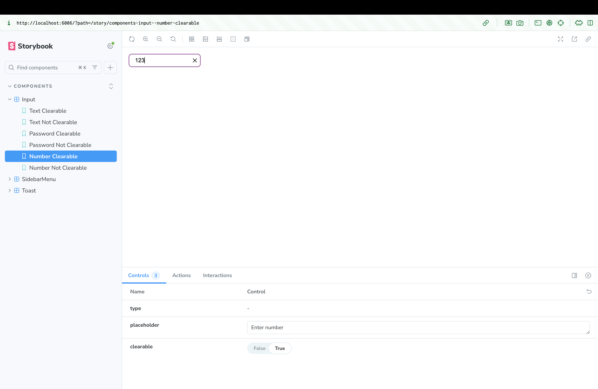
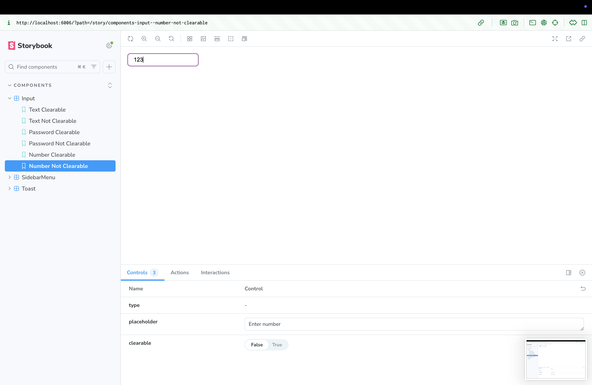
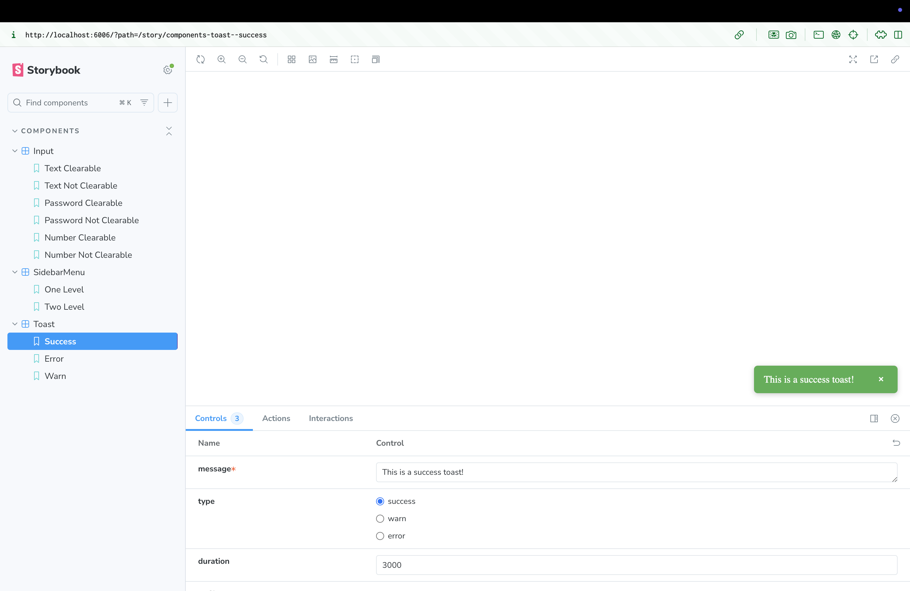
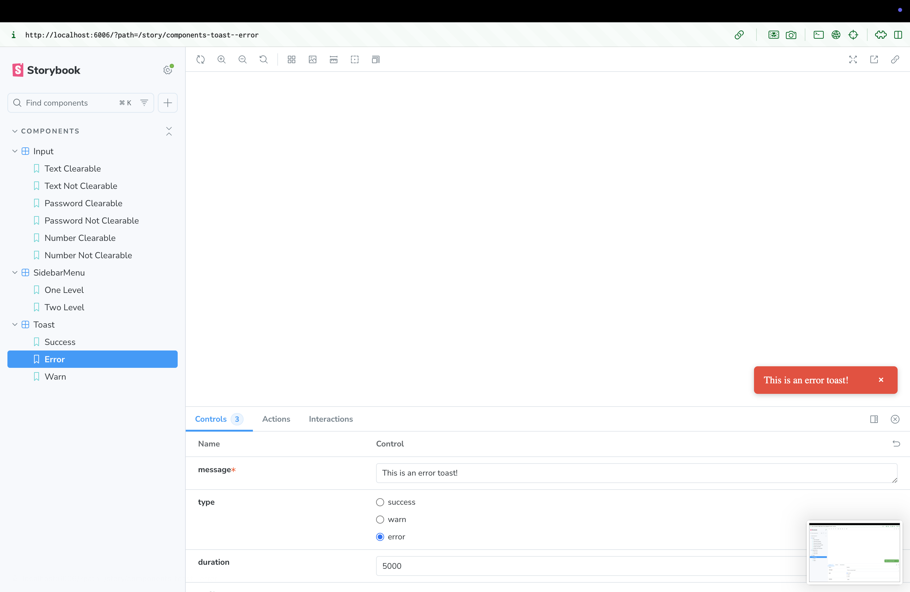
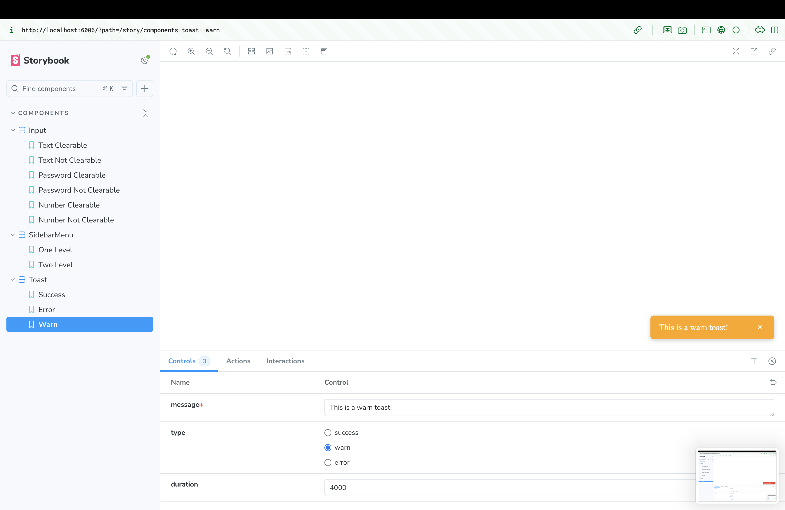

# 🎨 React Component Library

A small **React component library** created as part of a technical assessment. Includes reusable UI components built with **React** and **Storybook**, supporting multiple states and interactive previews. 🧩

## ✅ Completed Tasks

- **Input Component:** text, password, number types; clearable; password toggle; React Hook Form in stories; 6 story variants; screenshots included.
- **Toast Component:** success, error, info types; auto-dismiss; fade/slide animations; optional manual close; 3 screenshot variants.
- **Sidebar Menu Component:** open state rendering; nested menus (1-level & 2-level); 4 screenshot variants.

## ⚙️ Setup & Run

```bash
git clone https://github.com/xasiyevkenan/React-Component-Library.git
cd React-Component-Library
npm install
npm run storybook
Storybook will open at http://localhost:6006 with all components interactive.
```

## Optional static build:

```bash
npm run build-storybook
```

# 💻 Tech Stack

- **React 18+ ⚛️ | TypeScript 📝 | Storybook 📚 | ESLint + Prettier ✨ | React Hook Form 🛠️ | CSS / Styled Components 🎨**

# 🔧 Features

- **Input Component:** multi-type, clearable, password toggle

- **Toast Component:** multiple types, auto-dismiss, fade/slide animations

- **Sidebar Menu:** open state, 1-level & 2-level nested menus

Interactive Storybook previews

Fully modular, TypeScript-based

Screenshots for all components

# Input Component

- **Text (Clearable)**
  

- **Text (Not Clearable)**
  

- **Password (Clearable)**
  

- **Password (Not Clearable)**
  

- **Number (Clearable)**
  

- **Number (Not Clearable)**
  

# Toast Component

- **Success✅**
  

- **Error❌**
  

- **Warn⚠️**
  

# Sidebar Menu Component

- **Open (No Nested)**
  

- **Open (1-Level Nested)**
  

- **Open (2-Level Nested → Step 1)**
  

- **Open (2-Level Nested → Step 2)**
  
