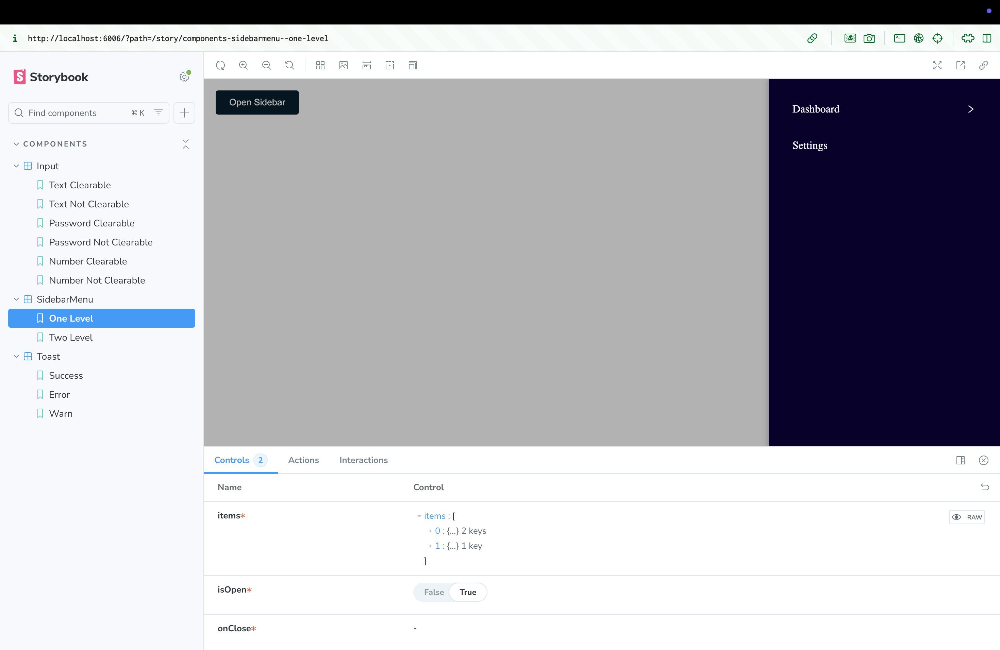
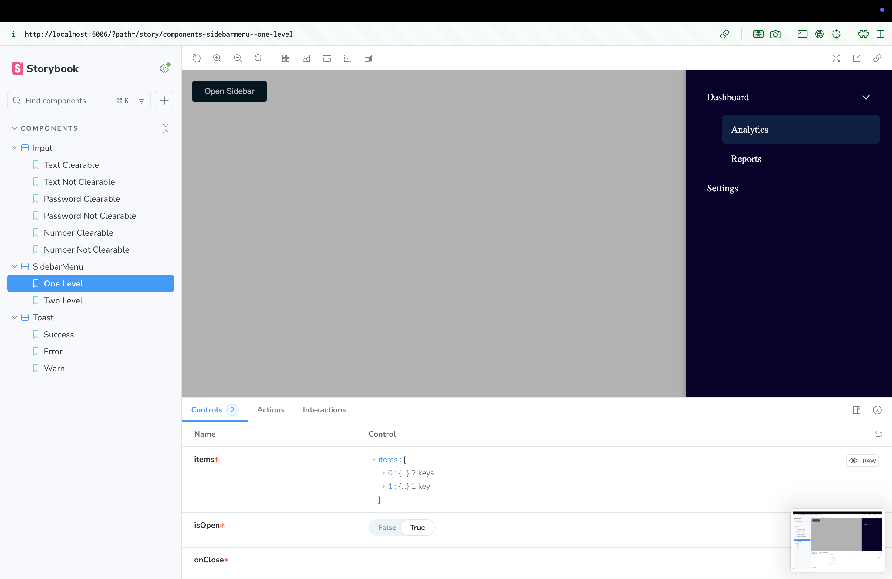
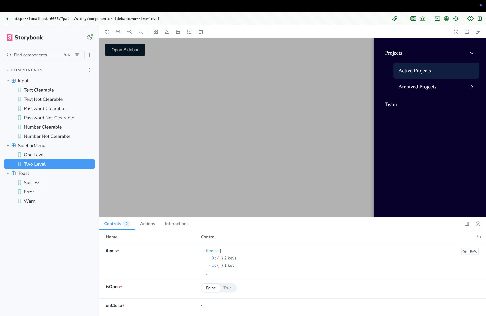
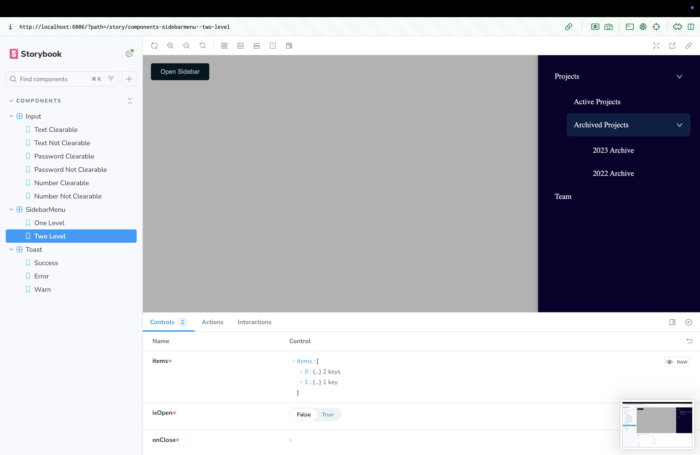

React Component Library – Task Summary
🎯 Overview

This repository contains a small React component library built as part of a technical assessment.
The goal was to implement reusable UI components with multiple states and Storybook integration.

✅ Completed Tasks
1️⃣ Input Component

Multi-type support: text, password, number

Password visibility toggle

Clearable option

React Hook Form used in stories

Storybook stories for all 6 variants

Screenshots prepared for each variant

2️⃣ Toast Component

Notification types: success, error, info

Auto-dismiss with configurable duration

Fade/slide animations

Optional manual close

3 screenshot variants included

3️⃣ Sidebar Menu Component

Open state rendering

Nested menus: 1-level and 2-level

Screenshots for:

Open (no nested)

Open (1-level nested)

Open (2-level nested → first step)

Open (2-level nested → second step)

📂 Project Highlights

Fully TypeScript-based

Storybook integration with interactive component previews

ESLint + Prettier for consistent code style

Clean and modular folder structure:

src/
├── components/
│ ├── Input/
│ ├── Toast/
│ └── SidebarMenu/
├── stories/
└── index.ts

📷 Screenshots
1️⃣ Input Component

Text (Clearable)

Text (Not Clearable)

Password (Clearable)

Password (Not Clearable)

Number (Clearable)

Number (Not Clearable)

2️⃣ Toast Component

Success

Error

Info

3️⃣ Sidebar Menu Component

Open (No Nested)

Open (1-Level Nested)

Open (2-Level Nested → Step 1)

Open (2-Level Nested → Step 2)

